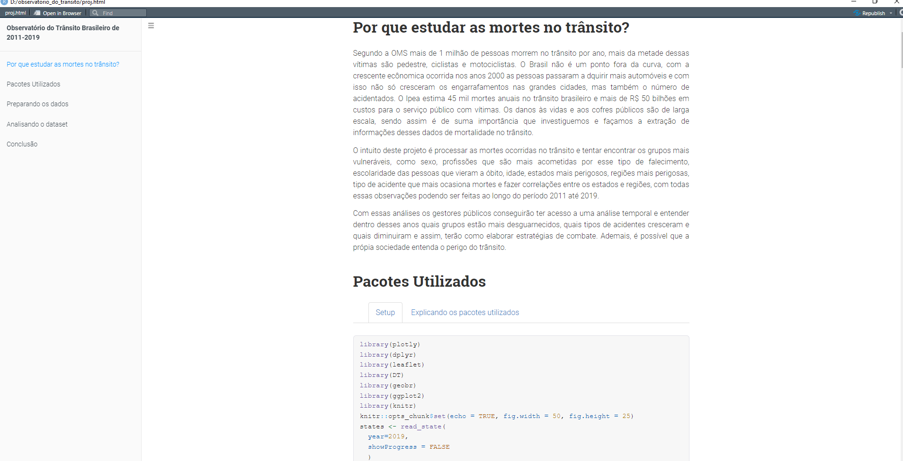

# Motivação

Esse repositório foi desenvolvido para compartilhar as bases de dados e o código utilizado para construção de um relatório dinâmico sobre mortes ocorridas no trânsito brasileiro de 2011 até 2019. 

Ferramentas: 
  - Rstudio
  - R
  - RMarkdown
  - Mysql
  
Base de dados:

1. Mortalidade

Os dados utilizados nesse relatório foram retirados do sistema de mortalidade do Estado brasileiro. Nele foram extraidos os arquivos .csv de 2011 até 2019, esses dados foram postos em um banco de dados e posteriormente utilizei consultas SQL para buscar óbitos com CID que se inicie com a letra V, que são óbitos ocorridos no trânsito. 

2. Estados

Base de dados disponibilizada no github com o código do estado, a sigla e o seu nome

3. Regiões

Base criada manualmente para obter o código da região e seu nome

4. CIDs relacionados a trânsito

Base construída localmente através de consultas SQL em uma base local utilizada durante estágio no TCE-PE

## Imagens da APlicação 

# Link para o relatório dinâmico

